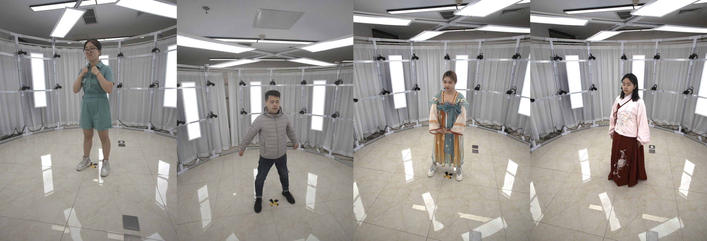

# THUman5.0 Dataset



### DiffuStereo: High Quality Human Reconstruction via Diffusion-based Stereo Using Sparse Cameras
Ruizhi Shao, Zerong Zheng, Hongwen Zhang, Jingxiang Sun, Yebin Liu

[[Project Page]](http://liuyebin.com/diffustereo/diffustereo.html)


This dataset contains 10 multi-view video sequences used in our paper "DiffuStereo: High Quality Human Reconstruction via Diffusion-based Stereo Using Sparse Cameras". They are captured with 32 well-calibrated RGB cameras in 30 fps, with a resolution of 4096x3000 and lengths ranging from 1000 to 5000 frames.

## Agreement
1. The THUman5.0 dataset (the "Dataset") is available for **non-commercial** research purposes only. Any other use, in particular any use for commercial purposes, is prohibited. This includes, without limitation, incorporation in a commercial product, use in a commercial service, as training data for a commercial product, for commercial ergonomic analysis (e.g. product design, architectural design, etc.), or production of other artifacts for commercial purposes including, for example, web services, movies, television programs, mobile applications, or video games. The dataset may not be used for pornographic purposes or to generate pornographic material whether commercial or not. The Dataset may not be reproduced, modified and/or made available in any form to any third party without Tsinghua University’s prior written permission.

2. You agree **not to** reproduce, modified, duplicate, copy, sell, trade, resell or exploit any portion of the images and any portion of derived data in any form to any third party without Tsinghua University’s prior written permission.

3. You agree **not to** further copy, publish or distribute any portion of the Dataset. Except, for internal use at a single site within the same organization it is allowed to make copies of the dataset.

4. Tsinghua University reserves the right to terminate your access to the Dataset at any time.


## Download Instructions 
The dataset can be directly downloaded from the following links.

* DEMO: [this link](), 1 processed frame for DEMO test.
* SUBJECTS: [this link]()

Note again that by downloading the dataset you acknowledge that you have read the agreement, understand it, and agree to be bound by them. If you do not agree with these terms and conditions, you must not download and/or use the Dataset.


<!-- ## Data Explanation
For each subject, we provide the multi-view images (```./subject0*/images/cam**/```) as well as the foreground segmentation (```./subject0*/masks/cam**/```), which are obtained using [BackgroundMattingV2](https://github.com/PeterL1n/BackgroundMattingV2). The calibration data is provided in ```calibration.json```, and the SMPL fitting in ```smpl_params.npz```. Some frames are losed during the capture process, and we provide their filename in ```missing_img_files.txt```.  -->


## Related Datasets from THU3DV Lab [[Link]](http://liuyebin.com/)
[[THuman4.0 Dataset]](https://github.com/ZhengZerong/THUman4.0-Dataset) Containing 3 multi-view image sequences, where each is captured with 24 well-calibrated RGB cameras in 30 fps, with a resolution of 1330x1150 and lengths ranging from 2500 to 5000 frames.

[[THuman3.0 Dataset]](https://github.com/fwbx529/THuman3.0-Dataset) Containing 20 human-garment combinations, where each combination has 15 to 35 high-quality human scans captured by a dense DLSR rig.  

[[MultiHuman Dataset]](https://github.com/y-zheng18/MultiHuman-Dataset/) Containing 453 high-quality scans, each contains 1-3 persons. The dataset can be used to train and evaluate multi-person reconstruction algorithms.

[[THuman2.0 Dataset]](https://github.com/ytrock/THuman2.0-Dataset) Containing 500 high-quality human scans captured by a dense DLSR rig, with SMPL annotations. 


## Citation
If you use this dataset for your research, please consider citing:
```
@inproceedings{shao2022diffustereo,
    author = {Shao, Ruizhi and Zheng, Zerong and Zhang, Hongwen and Sun, Jingxiang and Liu, Yebin},
    title = {DiffuStereo: High Quality Human Reconstruction via Diffusion-based Stereo Using Sparse Cameras},
    booktitle = {ECCV},
    year = {2022}
}
```

## Contact
- Ruizhi Shao [(shaorz20@mails.tsinghua.edu.cn)](mailto:shaorz20@mails.tsinghua.edu.cn)
- Yebin Liu [(liuyebin@mail.tsinghua.edu.cn)](mailto:liuyebin@mail.tsinghua.edu.cn)