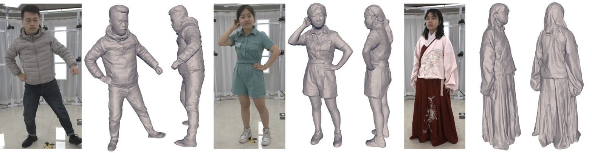

**News**

* `31/07/2022` We plan to release the THUman5.0 dataset for acadamic use. The dataset contains 10 dynamic human sequences which are captured by 32 RGB cameras with resolution of 4000x3096. Please see [here](DATASET.md) for more detais. 

# DiffuStereo: High Quality Human Reconstruction via Diffusion-based Stereo Using Sparse Cameras
### [Project Page](http://liuyebin.com/diffustereo/diffustereo.html) | [Paper](https://arxiv.org/pdf/2207.08000.pdf) | [Data](DATASET.md)



> [DiffuStereo: High Quality Human Reconstruction via Diffusion-based Stereo Using Sparse Cameras](https://arxiv.org/pdf/2207.08000.pdf)  
> Ruizhi Shao, Zerong Zheng, Hongwen Zhang, Jingxiang Sun, Yebin Liu
> ECCV 2022

We plan to release the training and testing code of DiffuStereo in this repository as soon as possible.  Any discussions or questions would be welcome!

## Installation

Please see [INSTALL.md](INSTALL.md) for manual installation.

## Pretrained model

We will provide the pretrained diffusion models for stereo matching including 20 degree and 45 degree as soon as possible. You can download and put them into the `checkpoints/` directory.

[Download: pretrained model for 20 degree stereo matching](https://mailstsinghuaeducn-my.sharepoint.com/:u:/g/personal/shaorz20_mails_tsinghua_edu_cn/EUgJEhePS11On81j2r7NGj8Bj8XZmRc0LqhD7kxUrNJBJA?e=TXXoPg)

## Run the code on the THUman2.0 dataset

Please see [THUman2.0](THUMAN2_0.md) to download DEMO samples and the dataset.

### Structure of DEMO samples

```
thuman_demo/
├── depth_db
│   └── 0001
│       ├── xxx.npz  --- the depth of view xxx (reconstructed by DoubleField)
├── img
│   └── 0001
│       ├── xxx.png  --- the image of view xxx
├── mask
│   └── 0001
│       ├── xxx.png  --- the mask of view xxx
├── normal_db
│   └── 0001
│       ├── xxx.png  --- the normal of view xxx (reconstructed by DoubleField)
└── parameter        --- We use perspecive camera model to render images
    └── 0001   
        ├── xxx_extrinsic.npy  --- the extrinsic of view xxx (3x4 world-to-camera matrix)
        ├── xxx_intrinsic.npy  --- the intrinsic of view xxx (3x3 matrix, the y-axis need to be flipped)
```

### Inference on a single stereo matching pair
To inference on a single stereo matching pair of DEMO samples, please run the following script.

```
python -m app.inference --config configs/thuman_demo.yaml --dataroot [the directory of DEMO samples] --view_list 0 20
```

### Visualization on a single stereo matching pair
The results will be saved in `results/thuman_demo/`. To visualize the results, use [MeshLab](https://www.meshlab.net/) to open `results/thuman_demo/fusion000.ply` and apply Possion Reconstruction with `depth=10`.

### Inference on multiple stereo matching pairs
To inference on multiple stereo matching pairs of DEMO samples, please run the following script.

```
python -m app.inference --config configs/thuman_demo_multi.yaml --dataroot [the directory of DEMO samples] --view_list 0 20 90 110 180 200 270 290 --use_db_normal
```

For cases with 45 degree, please run the following script.

```
python -m app.inference --config configs/thuman_demo_multi_45.yaml --dataroot [the directory of DEMO samples] --view_list 0 45 90 135 180 225 270 315 --use_db_normal
```

### Naive multi-view fusion and visualization on the results
The results will be saved in `results/thuman_demo_multi/`. To fuse multi-view depth point clouds, use [MeshLab](https://www.meshlab.net/) to open `results/thuman_demo_multi/fusion000.ply` and apply Possion Reconstruction with `depth=10`.

## Run the code on the THUman5.0 dataset

Please see [DATASET.md](DATASET.md) to download DEMO samples and the dataset.

### Structure of DEMO samples
```
real_demo/
├── depth_db
│   └── 0001
│       ├── xxx.npz  --- the depth of view xxx (reconstructed by DoubleField)
├── img
│   └── 0001
│       ├── xxx.jpg  --- the image of view xxx (after undistortion)
├── mask
│   └── 0001
│       ├── xxx.jpg  --- the mask of view xxx (after undistortion)
├── normal_db
│   └── 0001
│       ├── xxx.png  --- the normal of view xxx (reconstructed by DoubleField)
└── parameter        --- parameters of real world perspective camera model (after undistortion)
    └── 0001   
        ├── xxx_extrinsic.npy  --- the extrinsic of view xxx (3x4 world-to-camera matrix)
        ├── xxx_intrinsic.npy  --- the intrinsic of view xxx (3x3 matrix)
```

### Inference on one stereo matching pair
To inference on a single stereo matching pair of DEMO samples, please run the following script.

```
python -m app.inference --config configs/real_demo.yaml --dataroot [the directory of DEMO samples] --view_list 0 1
```

### Visualization on one stereo matching pair
The results will be saved in `results/real_demo/`. To visualize the results, use [MeshLab]() to open `results/real_demo/fusion000.ply` and apply Possion Reconstruction with `depth=11` or `depth=10`.

<video width="720" height="" autoplay>
  <source src="assets/video_real_demo.mp4" type="video/mp4">
</video>

### Multi-view fusion
Naive multi-view fusion based on `Poisson Reconstruction` will generate noise and artifacts. We recommend using traditional multi-view fusion algorithm or programming our proposed `light-weight multi-view fusion` to reproduce the final results.

## Training on the 3D human scan dataset

Please see [THUman2.0](THUman2_0.md) to download DEMO samples and the dataset.

### TODO

## Run the code on the custom dataset

Please see [CUSTOM](CUSTOM.md).

## Citation

If you find this code useful for your research, please use the following BibTeX entry.

```
@inproceedings{shao2022diffustereo,
    author = {Shao, Ruizhi and Zheng, Zerong and Zhang, Hongwen and Sun, Jingxiang and Liu, Yebin},
    title = {DiffuStereo: High Quality Human Reconstruction via Diffusion-based Stereo Using Sparse Cameras},
    booktitle = {ECCV},
    year = {2022}
}
```

## Acknowledgments

Our project is benefit from these great resources:

- [Diffusion Probabilistic Models for 3D Point Cloud Generation](https://github.com/luost26/diffusion-point-cloud)
- [Diffusion Models Beat GANS on Image Synthesis](https://github.com/openai/guided-diffusion)
- [RAFT-Stereo: Multilevel Recurrent Field Transforms for Stereo Matching](https://github.com/princeton-vl/RAFT-Stereo)
- [StereoPIFu: Depth Aware Clothed Human Digitization via Stereo Vision](https://github.com/CrisHY1995/StereoPIFu_Code)
- [POP: The Power of Points for Modeling Humans in Clothing](https://github.com/qianlim/POP)

Thanks for their sharing code.